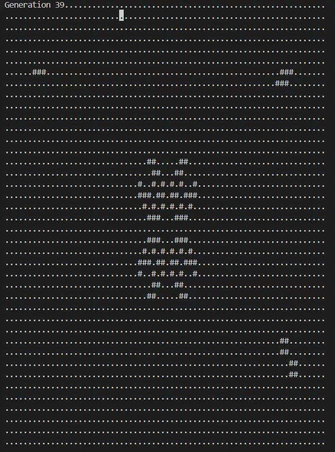

# Conway's Game of Life

<p align="center">
  
</p>

## Project Overview

This project implements **Conway's Game of Life** using the C programming language. The program simulates the evolution of cells on a **40 × 70** board according to Conway's cellular automaton rules. Different initialization modes are provided, including user-defined patterns, random generation, still lifes, oscillators, and the Gosper Glider Gun. The simulation is rendered in real time within the console and supports both Windows and Linux environments.

## Features

* Interactive menu for selecting different simulation modes
* Custom initialization by entering cell coordinates
* Random board generation
* Built-in Still Life pattern

  * Beehive
* Built-in Oscillator patterns

  * Blinker
  * Toad
  * Beacon
  * Pulsar
* Built-in Spaceship Generator

  * Gosper Glider Gun
* Real-time generation updates
* Cross-platform console support

## Technologies

### Programming Language

* C

### Core Concepts

* Cellular Automata
* Two-dimensional Arrays
* State Transition Simulation
* Neighbor Counting Algorithm
* Dynamic board update
* Cross-platform Console Programming

### Libraries

* `stdio.h`
* `stdlib.h`
* `time.h`
* `windows.h`
* `unistd.h`

## Program Structure

| Function           | Description                                                                 |
| ------------------ | --------------------------------------------------------------------------- |
| `main()`           | Displays the menu, initializes the board, and controls the simulation loop. |
| `initBoard()`      | Initializes the board according to the selected mode.                       |
| `displayBoard()`   | Renders the current board and generation number.                            |
| `countNeighbors()` | Counts the number of live neighbors surrounding each cell.                  |
| `updateBoard()`    | Applies Conway's Game of Life rules to generate the next generation.        |
| `gotoxy()`         | Moves the console cursor to redraw the board efficiently.                   |

## Demo

### Mode 4: Oscillators

<p align="center">
  
</p>

### Mode 5: Gosper Glider Gun


## Learning Outcomes

Through this project, I gained experience in:

* Implementing Conway's Game of Life using C
* Designing modular programs with multiple functions
* Simulating cellular automata using two-dimensional arrays
* Implementing neighbor-search algorithms
* Applying state transition rules
* Developing cross-platform console applications
* Managing real-time console rendering

## Future Improvements

Potential extensions of this project include:

* Adjustable simulation speed
* Pause / Resume functionality
* Pattern file loading and saving
* Infinite board implementation
* Colored console visualization
* GUI version using SDL or SFML
* Mouse-based interactive editing
* Performance optimization for larger boards

## Build and Run

### Windows

```bash
gcc main.c -o life.exe
life.exe
```

### Linux / macOS

```bash
gcc main.c -o life
./life
```

## Author

Course Project – Conway's Game of Life
